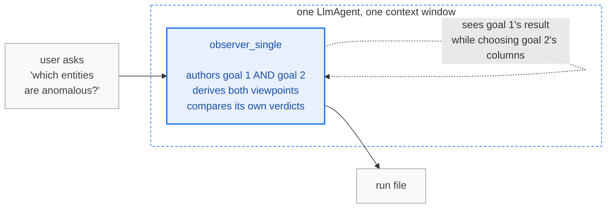
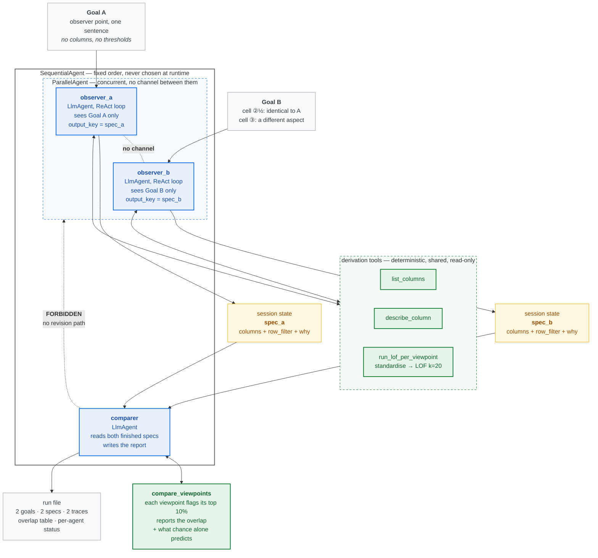
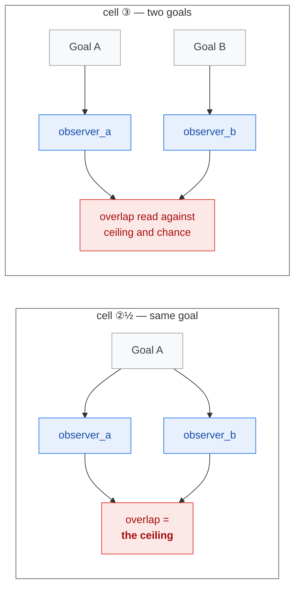

# Agentic design — two observers on Google ADK

Cells ②½ and ③ of FR-13. One architecture serves both: **only the goals differ.**

Google Cloud pattern: **Multi-Agent Parallel** nested inside **Multi-Agent Sequential**
— both in the *Deterministic Workflows* category.

---

## What exists today (cell ②) — one agent, two goals

The prompt forbids cross-contamination. Nothing **enforces** it — one context sees
everything. That is the claim cells ②½ and ③ exist to test.

---

## The two-observer design (cells ②½ and ③)

### Legend

| | |
|---|---|
| 🔵 **blue** | semantic plane — LLM. Chooses *where to look* and says *what results mean*. Never produces a number. |
| 🟢 **green** | statistical plane — code. Produces *every* score. Never chooses what to look at. |
| 🟡 **yellow** | session state — the only channel, and it flows one way |
| ┈ dotted red | edges that **must not exist**. Drawn so they stay visible in review. |

---

## The three invariants the diagram encodes

1. **No mind sees another's results before its own viewpoint is final.**
   The horizontal gap between `observer_a` and `observer_b` is the contribution.

2. **The comparer cannot revise anything.** It is a *synthesiser*, not a critic.
   A critic that may request revision would rebuild one brain out of three parts.

3. **The comparer has no derivation tool.** Only `compare_viewpoints`. Give it
   `run_lof_per_viewpoint` and it can hunt for columns that make a nicer story.

---

## Pattern mapping

| Google Cloud pattern | Used | Where |
|---|---|---|
| Multi-Agent Parallel | ✅ | the two observers, and the gather step |
| Multi-Agent Sequential | ✅ | outer pipeline: derive → compare |
| ReAct | ✅ | inside each observer — tool, observe, judge, repeat |
| Coordinator | ❌ | adaptive routing varies between runs → breaks comparability |
| Swarm | ❌ | all-to-all debate is the opposite of the isolation claim |
| Review & Critique | ❌ | a critic requests revision; that edge is forbidden |
| Loop / Iterative Refinement | ❌ | refining after seeing results is the tuning loop §6.5 forbids |
| Human-in-the-Loop | ➖ | the human input is the observer point, supplied up front |
| Custom Logic | ➖ | the `after_agent_callback` run-saver |

---

## The two cells, side by side

Two agents asked the **same** question show the most agreement you should ever
expect — the ceiling. Two agents asked **different** questions are then read
against that ceiling and against the chance line the tool already prints.
Without the ceiling, an overlap number has nothing to be compared to.

---

## Built — 18 August 2026

| Item | Where |
|---|---|
| The three agents and the wiring | `agent_adk_multiple/agent.py` |
| Observer prompt — phase 2 for ONE observer point | `_OBSERVER_HEAD`, built by `make_observer()` so the two cannot drift apart |
| Comparer prompt — phase 3, reading two finished specs | `_COMPARER_INSTRUCTION`, with `{spec_a?}` / `{spec_b?}` |
| Phase 1 replaced by a code dispatcher | `seed_goals()` — a `before_agent_callback`, not an LLM, so routing never varies between runs |
| Cell selected by goal count | one goal ⇒ ②½, two ⇒ ③, recorded as `cell` in the run file |
| Per-agent budget | `OBSERVER_BUDGET = 8` — a shared pool would let A starve B |
| Run schema | `cell` + `observers[]` in `utils/save_run.py`; `save_adk_multi_run` splits the trace per agent |
| Identical-viewpoint guard | `tools/compare_viewpoints.py` — sorted columns plus a filter signature, so column order and `None`-vs-omitted cannot fool it |
| Framework pinned | `requirements.txt`, `google-adk==2.6.3` |

Nothing about the scoring changed. Same four tools, same LOF, same `k=20`.

### Verified offline — no LLM calls spent

- Wiring is `SequentialAgent(ParallelAgent(observer_a, observer_b), comparer)`, and
  the comparer holds no scoring tool
- Templating: `{goal_a}` resolves, the literal JSON braces survive intact, and the
  *other* goal is absent from each observer's instruction
- `{spec_a?}`: a dead observer degrades to a one-viewpoint run instead of raising
  `KeyError`
- The duplicate guard fires on reordered columns and on `None`-vs-omitted filters,
  and does **not** fire when only the row filter differs
- Trace attribution: no tool call crossed agents; a failed observer is recorded
  `exhausted` per agent rather than hidden behind a completed run
- INV-6: the offline dummy regression still passes

### The ceiling, measured

Running the guard's two cases against the real dataset gives the calibration in
one table:

| | entities in the overlap |
|---|---|
| identical viewpoints — the **ceiling** | 2,064 |
| two genuinely different viewpoints | **294** |
| chance alone — the **floor** | 206 |

294 sits far nearer the floor than the ceiling, so those two viewpoints are close
to fully complementary. This is exactly why cell ②½ is not a throwaway: without
the ceiling, "294 against 206 expected by chance" reads as modest agreement and
has nothing to be scaled against.

---

## Verified: what ADK isolates, and what it does not

Checked against the installed source, **ADK 2.6.3**, and confirmed by running the
filter directly. The answer splits cleanly in two.

### Events (conversation history) — isolated BY THE FRAMEWORK ✅

`ParallelAgent._create_branch_ctx_for_sub_agent` gives every sub-agent its own
dotted branch path (`parallel_agent.py:40-51`). When a request is assembled,
`_is_event_belongs_to_branch` (`flows/llm_flows/contents.py:1124-1137`) admits an
event only if the agent's branch **equals** the event's, or the agent is a
**descendant** of it. Its docstring states the intent outright:

> *"This is for event context segregation between agents. E.g. agent A shouldn't
> see output of agent B."*

Run against the branch strings this design actually produces:

| Agent | Event from | Result |
|---|---|---|
| `observer_a` | `observer_b` | **BLOCKED** |
| `observer_b` | `observer_a` | **BLOCKED** |
| `comparer` | `observer_a` | **BLOCKED** |
| `comparer` | `observer_b` | **BLOCKED** |
| `observer_a` | root / user turn | sees |
| `observer_a` | itself | sees |

Siblings are mutually invisible. **The isolation claim is architectural, not a
prompt request.**

A bonus falls out: the comparer cannot see either observer's *reasoning trace*
either — only the specs they publish to state. `SequentialAgent` does not branch
(`sequential_agent.py:92` passes `ctx` unchanged), so the comparer sits at the
parent branch and the observers' deeper events are filtered out of its context.
That is stronger than the design asked for, and it is the right behaviour: the
comparer judges finished viewpoints, not the arguments behind them.

### Session state — NOT isolated ⚠️

`output_key` writes to `event.actions.state_delta[key]` (`llm_agent.py:999`),
which lands in session state. State is **global to the invocation** and is not
branch-scoped. Any agent whose instruction templates `{spec_b}` will receive it.

So the one hole is ours to keep closed, and it is closed by *not templating a
sibling's key into an observer's instruction*. Checkable by reading two prompts.

### The user's own turn — visible to both observers ⚠️

Found while wiring it up, and it limits the claim. `include_contents='none'`
does **not** hide the current turn — `_get_current_turn_contents` explicitly
keeps *"the current user input"* and the current turn's tool calls
(`contents.py:880-883`). The user's message also passes the branch filter,
because an event with no branch is admitted unconditionally
(`contents.py:1132-1133`).

So when two goals are typed in one message, **both observers can see both goals.**
What neither can see is the other's columns, evidence or results.

`include_contents='none'` is still set on the observers, for a different and real
benefit: it strips *previous* turns, so a second question in the same `adk run`
session cannot leak the first run's specs into a fresh observer.

**Wording for the write-up — say exactly this and no more:**

> Result-level isolation between observers is enforced by the framework: ADK's
> branch mechanism prevents each observer from seeing the other's events, and
> prevents the comparer from seeing either observer's reasoning trace. Goal-level
> isolation is enforced by construction — each observer's instruction names only
> its own observer point, and neither instruction references the other's state
> key — but both observers see the user turn in which the goals were supplied.

Result-level contamination is the one that matters: it is what would let observer
A tune its columns toward B's findings. Goal-level visibility only tells A what
aspect B was asked about. If that residue needs removing later, the fix is one
invocation per observer rather than one shared session — at the cost of the
single-run comparison unit.

### Two practical consequences

- **Missing keys raise.** `{spec_a}` on an absent key throws
  `KeyError: Context variable not found` (`utils/instructions_utils.py:140`). If a
  observer fails, the comparer crashes. Use the optional form `{spec_a?}` and have
  the comparer report a one-viewpoint run explicitly.
- **`ParallelAgent` is deprecated in 2.6.3**, in favour of the new graph-based
  `Workflow`. It still works, and `Workflow` is a different class hierarchy
  (`BaseNode(BaseModel)`, not `BaseAgent`) using the same `_BranchPath` isolation.
  **Pin the ADK version** and stay on the simple API — the same reasoning that
  pinned the model (§7, finding 4). Migrate after the experiments, not during.
