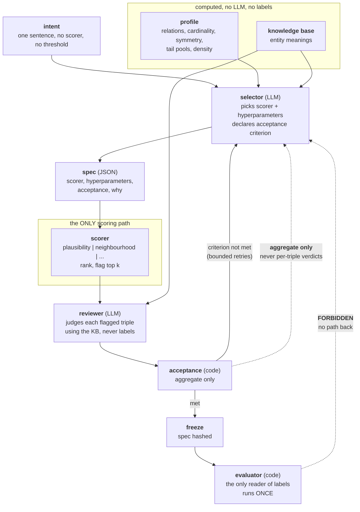

# Agentic multi-scorer KG anomaly detection — spec refinement

Proposed additions to `multi-observerbility-AD/PROJECT_SPEC.md`, adapted for
knowledge graphs. Written to slot in beside §3 (Core concepts) and §5
(Requirements) rather than replace them.

---

## 3.6 Scorer

A **scorer** is a deterministic function from a triple and a graph to a number.

```
scorer(triple, graph, hyperparameters) -> float
```

It never sees a label and never sees an intent. Two exist today:

| scorer | evidence it uses | needs a model |
|---|---|---|
| `plausibility` | a trained KGE model's score for the triple | yes |
| `neighbourhood` | share of the head's links that also reach the tail | no |

More will be added per anomaly type (the TRIC family). Adding one is two lines:
an entry in `VIEWPOINTS` and one in `DIRECTION`.

Scorers replace "columns" from the tabular work. In California housing a
viewpoint sliced the *attributes*; here it selects the *evidence*.

## 3.7 KG profile

A **profile** is a description of the graph computed without any LLM and
without any label: relation counts, cardinality, symmetry, tail-pool sizes and
overlap, degree distribution, mean neighbourhood density.

The profile is what makes the design portable. An agent reasons from it about
which scorers *fit this graph* before running anything:

> `neighbor` is 98% symmetric and locally dense, so shared-neighbour support
> should carry signal. `locatedin` has only 28 distinct tails, so type
> structure is strong.

Nothing about any particular dataset is hardcoded. On a different KG the
profile differs and the agent chooses differently.

## 3.8 The evaluation loop

An agent MAY iterate: run a scorer, inspect the outcome, change the scorer or
its hyperparameters, run again. This is a deliberate feature — it is what
removes a human from the inner loop of method selection.

What it may inspect is constrained. See §3.9.

## 3.9 The label firewall — replaces the tuning-loop prohibition

The earlier rule ("no revision path, ever") was too broad. It forbade a loop
that is genuinely useful because of a failure mode that is narrower than the
loop itself.

**The real hazard is not iteration. It is iterating against the answer key.**
An agent that switches method until the flagged set *looks right* has chosen
the method for its output, and any finding it reports is unfalsifiable.

So the rule becomes a firewall rather than a ban:

> **An agent's acceptance criterion must be computable without ground truth.**

Feedback the agent MAY use, all label-free:

| signal | what it tells the agent |
|---|---|
| score distribution | is the scorer discriminating at all, or flat? |
| inter-scorer agreement | do independent scorers converge on the same triples? |
| stability | does the flagged set survive a reseed or a resample? |
| coverage | what fraction of the graph did this slice actually examine? |
| semantic consistency | do the flagged triples involve the relations the stated intent is about? |
| leave-one-out effect | does deleting a flagged triple change other triples' scores? |

Inter-scorer agreement is the strongest of these and is measurable today:
`plausibility` and `neighbourhood` correlate at Spearman 0.011 on real triples,
yet their fusion catches more anomalies than either alone *or their union*.
Agreement between near-orthogonal scorers is evidence, and it needs no labels.

Feedback the agent may NOT use:

- per-triple labels, in any form
- any metric derived from labels (precision, recall, AUC)
- the count of true anomalies
- a flagging budget derived from the known contamination rate

## 3.10 Two claims, two protocols

The architecture supports two distinct claims. They need different designs and
must not be reported as one result.

### Claim A — the agent selects methods well (research)

Requires labels to evaluate, therefore requires a freeze.

```
FIT split    agent iterates freely; label-free feedback only
             |
             spec frozen and content-hashed
             |
EVAL split   run once. THIS is the reported number.
```

Null model, as in FR-10: **agent-selected vs hand-built vs random** scorer and
hyperparameter choice. If agent-selected does not beat random selection, the
claim dies here.

### Claim B — the loop reduces human review (practical)

No freeze needed, because the loop never reads labels in the first place.

Metric: **triples a human must review to find N real errors.**

This is precision-at-k restated as labour. It is the claim that matters
operationally, and the one the agentic loop most directly serves. Labels are
used exactly once, at the end, to score the finished output.

## 5. Requirements — additions

| ID | Requirement | Status |
|---|---|---|
| FR-14 | A KG profile is computed from the graph alone, with no LLM and no labels | PLANNED |
| FR-15 | Scorers are registered in one dispatch table with a declared direction; adding one touches no detector | DONE |
| FR-16 | Every scorer exposes named hyperparameters an agent can set | PARTIAL |
| FR-17 | The agent's acceptance criterion is stated in the spec **before** iterating, and is computable without labels | PLANNED |
| FR-18 | FIT/EVAL split with content-hashed spec freezing, for Claim A only | PLANNED |
| FR-19 | Feedback to the SELECTOR is aggregate. The reviewer sees flagged triples (it must), but no label. See INV-12 revised in §3.11 | PLANNED |
| FR-20 | Human-review cost is reported as triples-reviewed-per-true-error | PLANNED |

## Invariants — additions

- **INV-11** An agent's acceptance criterion is computable without ground
  truth. No label, and no metric derived from a label, may enter the loop.
  *Why: an agent that tunes against the answer key has chosen its method for
  its output, and the finding cannot be falsified.*

- **INV-12** *(superseded — see the revised form in §3.11)* Feedback returning
  to the selector is aggregate, never per-triple. *Why: per-triple feedback lets
  the selector tune for individual triples, which is INV-11 evaded one level
  down. The reviewer is a separate role and does see triples; it never sees
  labels.*

- **INV-13** A slice or scorer configuration may never be defined in terms of a
  score. *Why: `{"score": {"max": 0.5}}` selects the answer rather than the
  question. The prompt is not enough — enforce it in a `before_tool_callback`,
  as `pin_viewpoints` already does.*

- **INV-14** For Claim A, the spec is frozen and content-hashed before the EVAL
  split is touched, and EVAL is run exactly once per spec. *Why: a second run
  after seeing EVAL turns EVAL into FIT.*

- **INV-15** A scorer never reads the ground-truth file. Enforced structurally:
  only the evaluator imports it, and only after every score exists.
  *Verified by permuting the label column and confirming scores are
  bit-identical.*

## Known limits

1. **Two scorers is a small menu.** With so few methods and hyperparameters,
   "the agent chose well" is hard to separate from luck — a script could try
   every combination. The architecture only becomes interesting once the menu
   is large enough that exhaustive search is impractical. Add the TRIC-derived
   scorers before running the Claim A experiment.

2. **The injected anomaly family matches the KGE negative sampler.** Uniform
   random tail swaps are what the model was trained to reject, so
   `plausibility` has a built-in advantage that would not hold against real KG
   errors. A real-error arm (CoDEx-style) is needed before any absolute number
   is quoted.

3. **n = 1 dataset.** Everything measured so far holds on Countries and nothing
   says it holds elsewhere.

---

## 3.11 Reviewer — the agent's second role

The agent does two separate jobs. Keeping them apart is load-bearing.

| role | reads | produces |
|---|---|---|
| **selector** | intent + KG profile + knowledge base | a spec: scorer, hyperparameters, acceptance criterion |
| **reviewer** | flagged triples + knowledge base | a plausibility verdict per triple |

The reviewer is the label-free evaluator. Its judgement comes from **domain
knowledge**, not from the scores — geography tells it `chad locatedin europe`
is wrong and `eastern_africa locatedin africa` is fine. That is why the loop is
not circular: the agent is not grading its own work, it is applying knowledge
the scorer never had.

This is the job a human reviewer does today. The agent replaces the reviewer,
not the detector. Code still produces every number.

**Selector and reviewer must be separate agents.** One agent doing both would
be free to pick methods whose output it can most easily justify. Same reasoning
as the observer/comparer split in `agent_adk_multiple`.

## 3.12 Knowledge base

The reviewer can only judge what it can understand. The **knowledge base**
supplies entity meaning:

```
chad     -> "Chad, a landlocked country in north-central Africa"
/m/027rn -> "Cuba"
```

For Countries the entity names are already meaningful. For Freebase-style KGs
they are opaque ids and the KB is what makes review possible at all.

**The architecture's reach is bounded by what the KB can explain.** On a KG
whose entities the model cannot be told about, the reviewer role is unavailable
and only Claim A remains.

## 3.13 Where the reviewer's output may go

Two modes, reported separately. Never mixed.

| mode | reviewer verdicts are used for | measures |
|---|---|---|
| `--review off` | nothing; scorers alone produce the output | **Claim A** — method selection quality |
| `--review screen` | filtering the flagged set before a human sees it | **Claim B** — human review cost |

In `screen` mode the LLM is deliberately in the output path — that is the point
of the mode. In `off` mode it is not, which is what keeps Claim A honest.
Running one and reporting the other is the mistake this section exists to
prevent.

---

## 4a. Agentic architecture



Two arrows carry the whole design:

- **`ACC -> S` is aggregate only.** The selector learns *"68% of flags were
  judged plausible errors"*, never *which* ones. Per-triple feedback would let
  it tune for individual triples, which is INV-11 evaded one level down.
- **`EV -> S` does not exist.** Once labels are read, the run is over.

## 5b. Requirements — reviewer additions

| ID | Requirement | Status |
|---|---|---|
| FR-21 | Reviewer accuracy is measured against labels ONCE, offline, before the reviewer is used in any loop | PLANNED |
| FR-22 | Selector and reviewer are separate agents with no shared state | PLANNED |
| FR-23 | The selector receives aggregate review statistics only, never per-triple verdicts | PLANNED |
| FR-24 | `--review off` and `--review screen` are recorded in the run file; a run never reports one mode's number under the other's claim | PLANNED |
| FR-25 | An anonymised-entity condition tests whether reviewer accuracy is reasoning or memorisation | PLANNED |

## Invariants — reviewer additions

- **INV-12 (revised)** The agent may see flagged **triples** — it cannot review
  what it cannot read — but never their **labels**, and never any
  label-derived metric. The earlier "aggregate only" wording was wrong: it
  forbade the reviewer role entirely. What must stay aggregate is the feedback
  travelling *back to the selector*.

- **INV-16** Reviewer verdicts never alter a score or a rank. In `screen` mode
  they filter the final set; in `off` mode they are recorded and ignored.
  *Why: INV-3 still holds — no LLM output is a score, threshold, or ranking key.*

- **INV-17** A reviewer whose measured accuracy (FR-21) is below the declared
  threshold may not be used as an acceptance signal. *Why: a loop steered by an
  unreliable judge is worse than no loop, and silently so.*

## Build order

The first item gates everything after it.

| # | build | lines | why this order |
|---|---|---|---|
| 1 | `7_validate_reviewer.py` | ~70 | If the agent cannot judge geography reliably, the whole loop is unfounded. One agent call over 127 triples. **Do this first.** |
| 2 | `utils/profile.py` | ~90 | No LLM. Needed before a selector has anything to reason from. |
| 3 | `utils/kb.py` | ~60 | Entity meanings. Trivial for Countries, the hard part elsewhere. |
| 4 | scorer hyperparameters | ~40 | The selector needs something real to choose between. |
| 5 | `5_agent_detect.py` | ~110 | The loop itself. Last, because everything above constrains it. |

Before step 5, hand-run every scorer/hyperparameter combination. If the results
all land within a couple of points, there is nothing for a selector to choose
and the menu must grow first.
